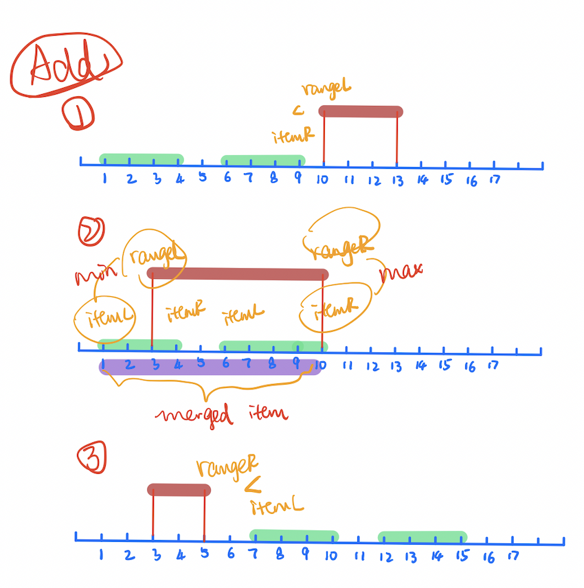
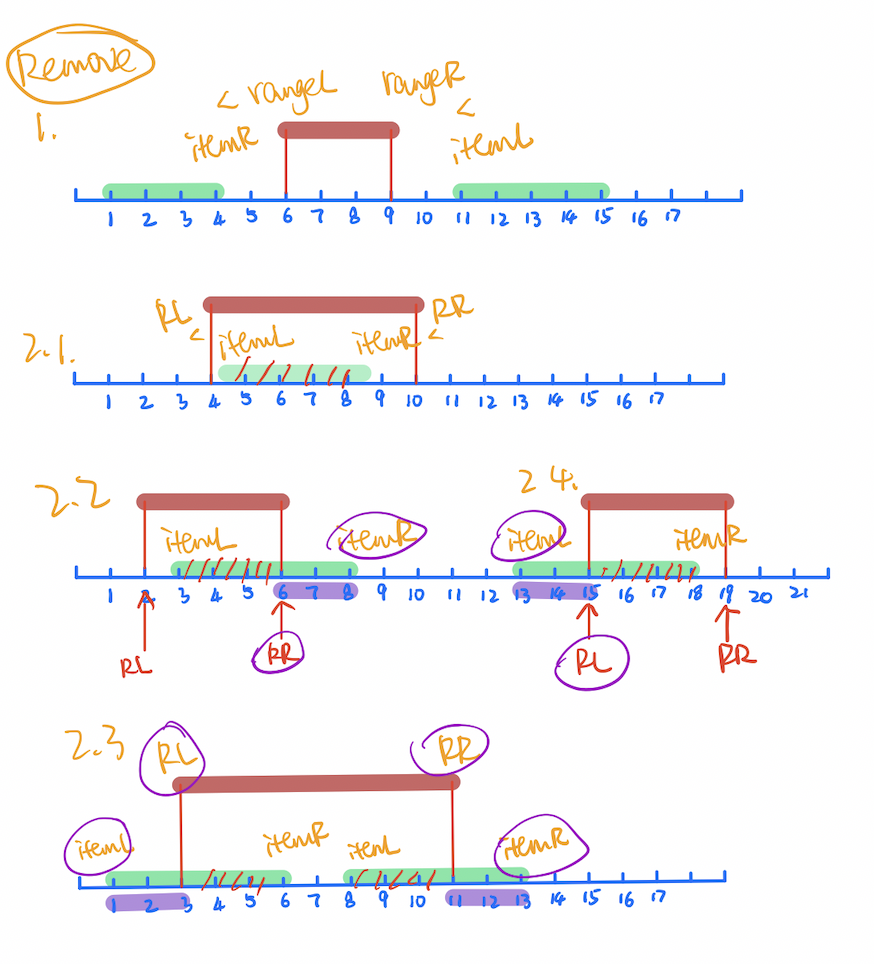

# rangelist

## how to run the program
```
### prerequisite: node & npm install
### npm run test

expect result should be:

 PASS  test/rangelist.test.js
  ✓ range list add function (1 ms)
  ✓ range list remove function
  ✓ range list add & remove function

Test Suites: 1 passed, 1 total
Tests:       3 passed, 3 total
Snapshots:   0 total
Time:        0.134 s, estimated 1 s
Ran all test suites.

```
## solution & chart
**add()** has 3 cases/phases
1. non overlapping, item array on left of the range array
    - push item to result
2. overlapping
     - update range array in place
3. non overlapping, item array on right of the range array
     - break the while loop 
- push range array to result
- push the rest item array to result
  


**remove()**  has 2 cases
1. non overlapping
    - push item to result
2. overlapping
   1. range array overlap whole item array 
      - skip item
   1. range array overlap left part item array 
      - slice & update item array
      - push item to result
   2. range array slice item array into 2 arrays
      - slice & update item array
      - push 2 item arrays to result
   1. range array overlap right part item array 
      - slice & update item array
      - push item to result
 


